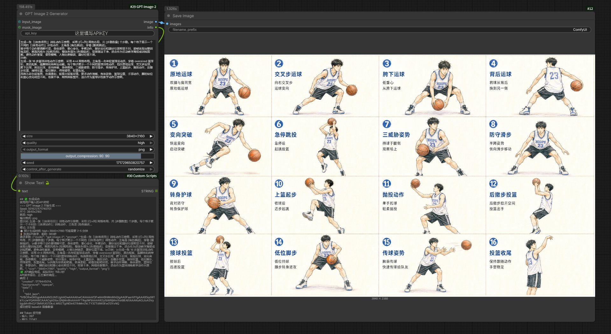

# ComfyUI GPT Image 2 插件

基于 [apiyi.com](https://api.apiyi.com) 的 **GPT Image 2**（OpenAI 旗舰图像生成模型）的 ComfyUI 插件。

> **下图由本插件生成**：4K 画质，16 格篮球训练动作示意图，展示了 GPT Image 2 在多主体、复杂构图和中文文字渲染上的能力。



## 功能特性

| 特性 | 说明 |
|------|------|
| **文生图** | 输入文本提示词生成图片 |
| **图片编辑** | 上传参考图 + 编辑指令生成新图片 |
| **多图融合** | 支持最多 5 张参考图同时输入 |
| **Mask 局部重绘** | 支持透明蒙版局部重绘 |
| **精确尺寸控制** | 8 种预设尺寸 + 自定义（最大 4K） |
| **画质档位** | low / medium / high / auto |
| **中文友好** | 原生支持中文提示词 |
| **文字渲染** | high 档位下精细文字几乎不糊 |

## API 定价

| 画质 | 1024×1024 | 1024×1536 | 1536×1024 |
|------|-----------|-----------|-----------|
| **Low** | $0.006 | $0.005 | $0.005 |
| **Medium** | $0.053 | $0.041 | $0.041 |
| **High** | $0.211 | $0.165 | $0.165 |

> 2K / 4K 按实际 token 消耗计费。

## 安装方式

### 方式一：克隆到 custom_nodes 目录

```bash
cd D:\ComfyUI\custom_nodes
git clone https://github.com/your-repo/ComfyUI-GPT-Image-2.git
cd ComfyUI-GPT-Image-2
pip install -r requirements.txt
```

### 方式二：手动复制

将整个 `ComfyUI-GPT-Image-2` 文件夹复制到 ComfyUI 的 `custom_nodes` 目录。

## 配置 API 密钥

首次使用时，在节点中输入您的 API 密钥（格式：`sk-xxxxxx`）。

密钥会自动保存到节点目录的 `api_key.txt` 文件中，后续使用无需重复输入。

## 节点参数说明

### 必填参数

| 参数 | 说明 |
|------|------|
| `api_key` | API 密钥（sk-xxxxxx格式） |
| `prompt` | 提示词（建议把场景描述放在最前面） |

### 尺寸选择

| 尺寸 | 像素 | 用途 |
|------|------|------|
| `1024x1024` | 1K | 方形图标、Logo |
| `1536x1024` | 1K | 横版 3:2 |
| `1024x1536` | 1K | 竖版 2:3 |
| `2048x2048` | 2K | 高清方形 |
| `2048x1152` | 2K | 横版 16:9 |
| `3840x2160` | 4K | 超高清横版 |
| `2160x3840` | 4K | 超高清竖版 |
| `auto` | 自适应 | 模型决定 |

> **预设尺寸经过官方优化，速度和质量更稳定**。超过 2560×1440 仍属实验性。

### 画质选择

| 画质 | 用途 | 速度 |
|------|------|------|
| `low` | 草图/批量测试 | 快 |
| `medium` | 日常使用（默认） | 中 |
| `high` | 文字/精细纹理/印刷 | 慢 |
| `auto` | 模型自动判断 | - |

### 输出格式

| 格式 | 特点 |
|------|------|
| `png` | 无损，适合精细图像 |
| `jpeg` | 体积小，可设置压缩率 |
| `webp` | 现代格式，支持压缩 |

### 可选参数

| 参数 | 说明 |
|------|------|
| `input_image` | 输入图像，用于编辑或多图融合 |
| `mask_image` | 蒙版图，透明区域将重绘（仅对第一张图生效） |
| `seed` | 随机种子，0 每次生成新图像 |

## 使用示例

### 1. 文生图

最简单的用法，直接输入提示词即可：

```
1:1 方形构图，一只穿着汉服的猫站在故宫红墙前，摄影质感
```

### 2. 图片编辑

连接输入图像，描述想要的变化：

```
把背景从室内换成海边日落，保留人物细节
```

### 3. 多图融合

连接多张输入图像，prompt 中用「图1/图2」指代：

```
把图1的人物放进图2的场景，沿用图3的色彩风格
```

### 4. Mask 局部重绘

上传原图和带透明通道的 MASK：

```
把天空换成粉色晚霞
```

> MASK 要求：与原图相同尺寸，带 alpha 通道，透明区域 = 要重绘的部分

## 输出节点

| 节点 | 类型 | 说明 |
|------|------|------|
| `IMAGE` | tensor | 生成的图像 |
| `STRING` | text | 生成信息和 Token 使用量 |

## 注意事项

### 超时设置

- high 画质 + 2K/4K 实测可能需要 **3-5 分钟**
- 节点默认超时 **360 秒**
- 草稿测试建议用 medium 或 low 画质

### 尺寸约束

GPT Image 2 接受自定义尺寸，需同时满足：

1. 最大边 ≤ 3840px
2. 两边都是 16 的倍数
3. 长短边比例 ≤ 3:1
4. 总像素在 0.65MP - 8.3MP 之间

### 迁移注意

- ❌ **不支持** `input_fidelity`（强制启用 high-fidelity）
- ❌ **不支持** `background: transparent`
- ✅ 多图最多 5 张
- ✅ b64_json 返回纯 base64（无前缀）

## 错误处理

| 状态码 | 含义 | 建议 |
|--------|------|------|
| 400 | 参数非法 | 检查 size 是否符合约束；不要传 input_fidelity |
| 401 | 令牌无效 | 检查 Bearer Token |
| 403 | 内容审核拦截 | 调整 prompt |
| 429 | 限流/余额不足 | 指数退避重试 |
| 5xx | 服务端错误 | 重试 1-2 次 |
| 超时 | 高峰偶发 | 等待后重试 |

## License

MIT License
